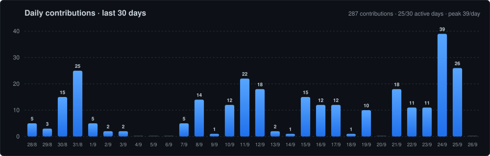
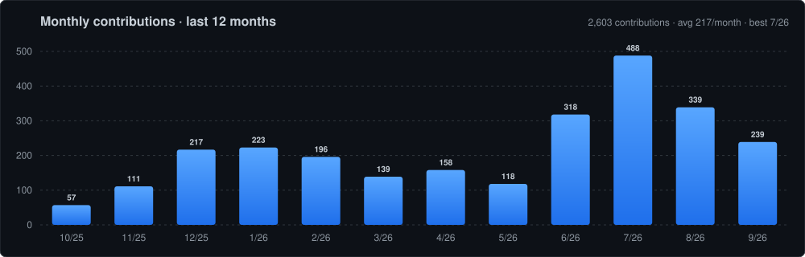
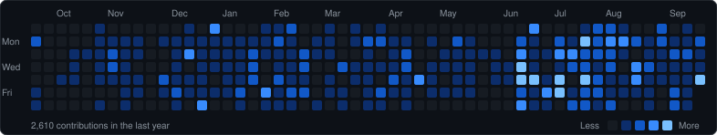

<!-- Header -->

  

  

  
  

---

### 🧑‍💻 About Me

- 👀 **Full Stack Developer** with a backend and infrastructure focus
- 🏫 Building large-scale **education technology** platforms: data collection, assessments, and reporting
- ⚙️ Hands-on with **Linux servers, Nginx, PM2, and MongoDB** in production
- 🌱 Currently learning **DevOps & Machine Learning**

---

### 🛠️ Tech Stack

  <b>Languages & Backend</b>  
  &nbsp;&nbsp;
  &nbsp;&nbsp;
  &nbsp;&nbsp;
  &nbsp;&nbsp;
  &nbsp;&nbsp;
  

  <b>Frontend & Mobile</b>  
  &nbsp;&nbsp;
  &nbsp;&nbsp;
  &nbsp;&nbsp;
  &nbsp;&nbsp;
  &nbsp;&nbsp;
  

  <b>Databases</b>  
  &nbsp;&nbsp;
  &nbsp;&nbsp;
  

  <b>Caching & Messaging</b>  
  &nbsp;&nbsp;
  

  <b>Cloud & DevOps</b>  
  &nbsp;&nbsp;
  &nbsp;&nbsp;
  &nbsp;&nbsp;
  

---

### 📊 GitHub Activity

  

  

  

### 📈 Contribution Graph

  

---

### 🌐 Connect with Me

  
  
  

<!-- Footer -->

  

